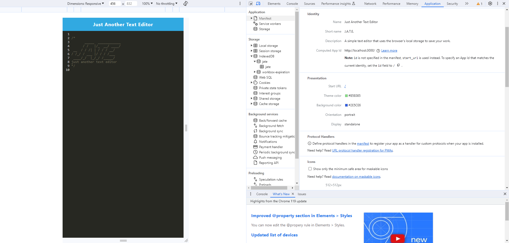
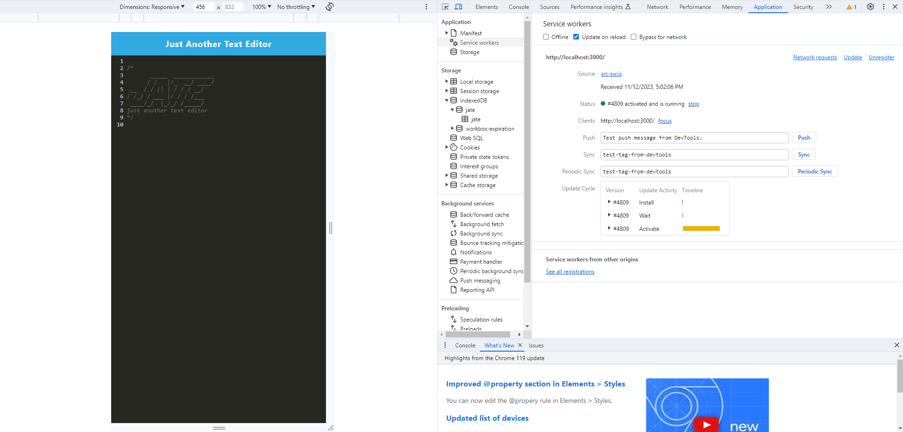
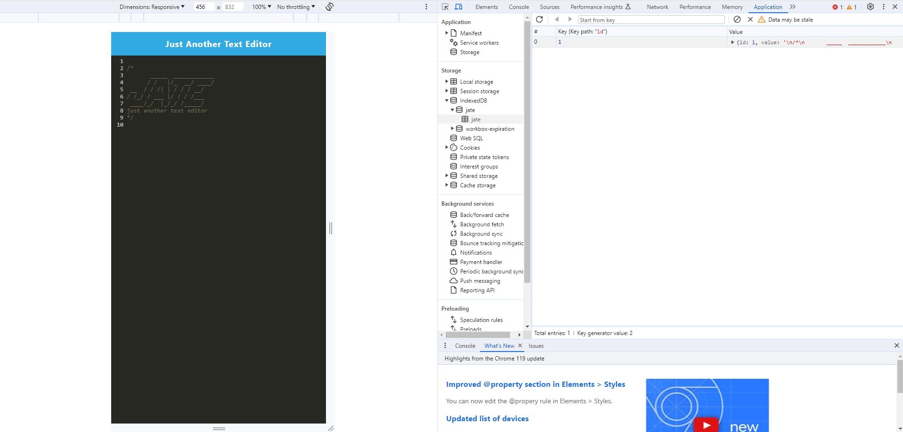
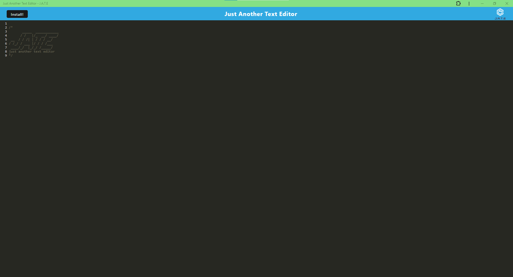

# PWA_Text_Editor

## Table of Contents
  - [Description](#description)
  - [Installation](#installation)
  - [Usage](#usage)
  - [License](#license)
  - [Contributing](#contributing)
  - [Tests](#tests)
  - [Questions](#questions)

  ## Description
  When creating this project, I set out to set to create a Progressive Web Application in the form of a text editor. I did this so that developers can have a place to freely right and copy down any notes or code, without having to mess up their projects. By completing this assignment, I learned how to use service workers.

 ## Installation
   To install this project, you will want to right click on root repository folder, and open a new integrated terminal. From here, use the following command to set up your node modules:

  ```npm run install```

  
  ## Usage
  To use this project on your local machine, use your root folder integrated terminal, and type in the following commands:
  
  ```npm run build```

  ```npm run start:dev```

 To ensure the page is running correctly, right click on the page and click the "Inspect" button. From there, go to the *Applications* tab. In the top row, you will see a tab called *Manifest*. If your page is running correctly, you should see a page that looks something like this:
 
  

From there, you can look down slightly and click on the *Service Worker* row. There, you'll be presented with this screen:

  

If you want to make sure your database has been stored correctly, you will want to look much farther down at a button that says *IndexedDB*. Once there, you'll want to click the dropdown button until you see the word *jate*. Once there, you will see another dropdown that also shows you the word *jate*, but with a symbol of a grid on the left. Finally, you will be able to see your database. It will look something like this:

  


Of course, this page also offers you the ability to install it as a Progressive Web Application, or "PWA". This can be achieved by clicking on the "Install!" button. The installed application will look like this:


  

Alternatively, you can click [This Link](https://pwa-test-editor-jeslocascio-d9f1ad1ab017.herokuapp.com/) to see J.A.T.E in action!
 
 ## License
 
  This project is licensed under the terms of the **[MIT License](https://opensource.org/licenses/MIT)**
  
  ## Contribution
  
Rutgers Fullstack Flex Coding Bootcamp provided the starter code.

Worked in parallel with Robert Kaise and Daniel Merkin.

## Tests
  
  N/A

  ## Questions
  If you have any questions or suggestions about this project, please feel free to contact me:
- GitHub: [@jeslocascio](http://github.com/jeslocascio)
- Email: locascioje@gmail.com

